# lab_1

**ОС:** Windows 11 |
**Терминал:** Windows PowerShell |
**Версия Docker:** 28.0.1

В качестве базового образа был выбран `nginx:alpine`.

## Задания

### 1) Версии и теги

* **Определим версии клиента и демона Docker.**
  
```bash
#выведем информацию о версии docker
docker version
```

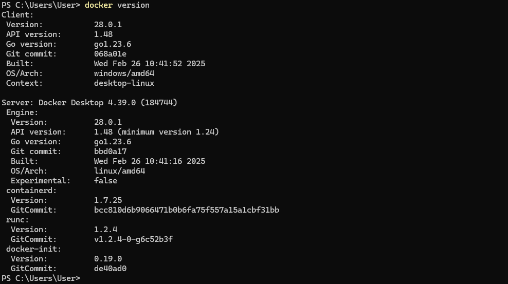

* **Запустим выбранный образ в конкретном теге(`nginx:alpine`)**

```bash
docker run -d --name test-nginx nginx:alpine
```

* **Отобразим работающие контейнеры**
```bash
docker ps
```

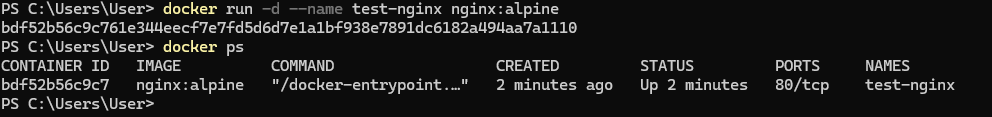

[Запуск конкретного тега](https://github.com/tiranousor/os-modern-docker-course/blob/main/4-course/docker-and-containers/lectures/02_commands.md)

### 2) Первый запуск сервиса (detached)

* Запускаем контейнер в фоновом режиме на порту 8080, потом перезапуск на порту 1111

```bash
#запуск на порту 8080
docker run -d --name lab-web-naadin -p 8080:80 nginx:alpine
```
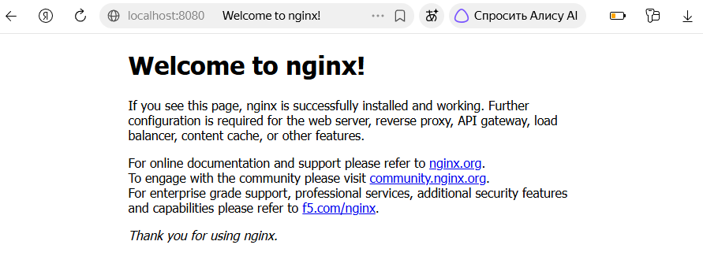
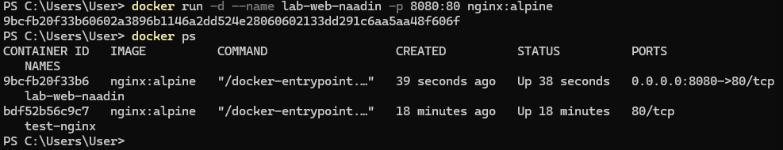

* Затем перезапуск на порту 1111

```bash
#запуск на порту 1111
docker run -d --name lab-web-naadin -p 1111:80 nginx:alpine
#отобразим работающие контейнеры
docker ps
```
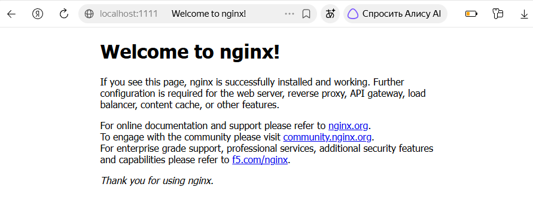
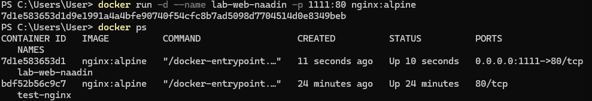

* `test-nginx` нужен был нам для того, чтобы убедиться, что образ `nginx:alpine` запускается, поэтому, в дальнейшем он нам не понадобиться, можем удалять

```bash
#остановка работающего контейнера по имени
docker stop test-nginx
#удаление остановленного контейнера
docker rm test-nginx
```
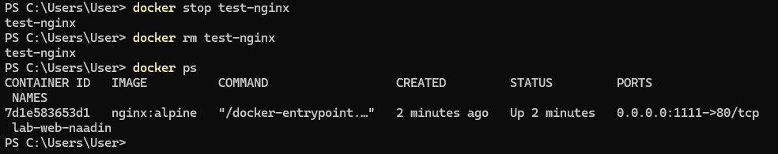

[Проброс портов](https://github.com/tiranousor/os-modern-docker-course/blob/main/4-course/docker-and-containers/lectures/03_docker_run.md#3-%D0%BF%D1%80%D0%BE%D0%B1%D1%80%D0%BE%D1%81-%D0%BF%D0%BE%D1%80%D1%82%D0%BE%D0%B2--p), [именование контейнеров](https://github.com/tiranousor/os-modern-docker-course/blob/main/4-course/docker-and-containers/lectures/03_docker_run.md#4-%D0%B8%D0%BC%D0%B5%D0%BD%D0%BE%D0%B2%D0%B0%D0%BD%D0%B8%D0%B5-%D0%BA%D0%BE%D0%BD%D1%82%D0%B5%D0%B9%D0%BD%D0%B5%D1%80%D0%BE%D0%B2---name)

### 3) Том (bind‑mount): сайт/данные из папки хоста
* Создание папки на хосте с тестовым файлом
  
```bash
mkdir site

"naadin" | Set-Content .\site\index.html
```

* Остановка и удаление предыдущего контейнера
```bash
docker stop lab-web-naadin
docker rm lab-web-naadin
```
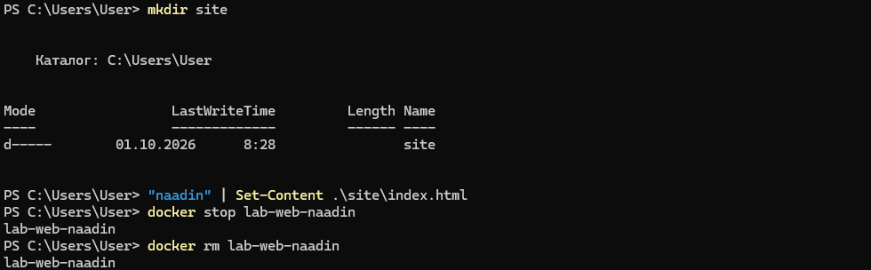

* Перезапуск `lab-web-naadin`, смонтировав папку как `read‑only`
```bash
#монтирование папки через :ro
docker run -d --name lab-web-naadin -p 8080:80 -v "${PWD}\site:/usr/share/nginx/html:ro" nginx:alpine 
```

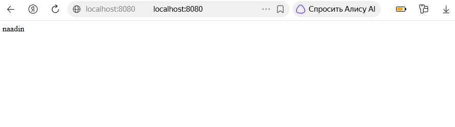

* Редактирование текста
```bash
"anin" | Set-Content .\site\index.html
```

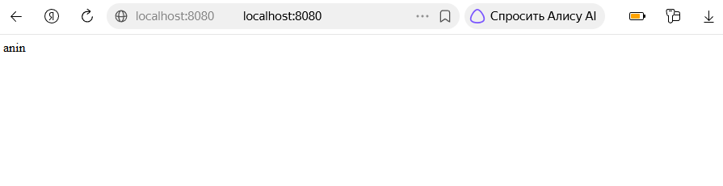
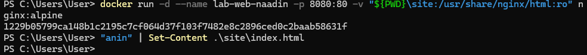


* Почему данные переживут удаление контейнера?

  Потому, что `site` находится на хосте, а не внутри контейнера, поэтому данные переживут удаление контейнера.

[Монтирование тома](https://github.com/tiranousor/os-modern-docker-course/blob/main/4-course/docker-and-containers/lectures/03_docker_run.md#5-%D1%82%D0%BE%D0%BC-%D0%B4%D0%BB%D1%8F-%D1%85%D1%80%D0%B0%D0%BD%D0%B5%D0%BD%D0%B8%D1%8F-%D0%B4%D0%B0%D0%BD%D0%BD%D1%8B%D1%85--v)

### 4) Интерактив / exec

* Заходим в работающий контейнер `lab-web-naadin` интерактивно
```bash
#запускаем новый процесс внутри работающего контейнера
docker exec -it lab-web-naadin /bin/sh

#переходим в каталог со статикой
cd /usr/share/nginx/html
#просмотр листинга каталога
ls -la
```
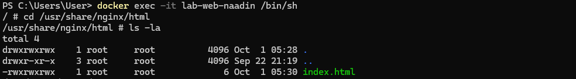

```bash
#создание файла при :ro
touch anin.txt
```
```bash
#получили ошибку, выходим
exit
```
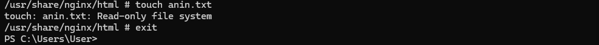

```bash
#останавливаем и удаляем контейнер
docker stop lab-web-naadin
docker rm lab-web-naadin
```
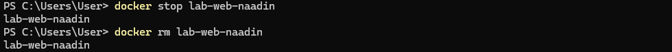

* Пересоздаем контейнер в режиме RW
```bash
docker run -d --name lab-web-naadin -p 8080:80 -v "${PWD}\site:/usr/share/nginx/html" nginx:alpine
```
```bash
#запускаем новый процесс внутри работающего контейнера
docker exec -it lab-web-naadin /bin/sh

#переходим в каталог со статикой
cd /usr/share/nginx/html

#создание файла
touch anin.txt

#просмотр листинга каталога
ls -la

#выход
exit
```
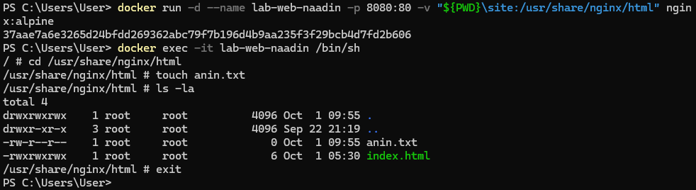

* Файл на хосте после режима RW
```bash
#посмотрим содержимое папки site в текущем каталоге
dir .\site
```
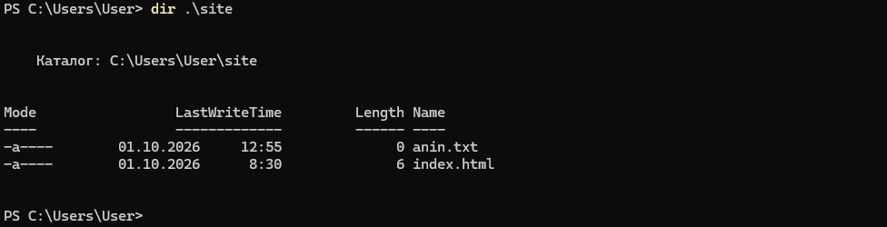
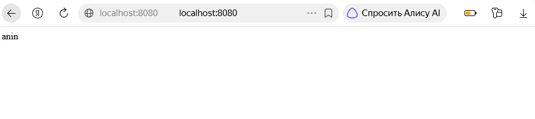

[Интерактивный режим](https://github.com/tiranousor/os-modern-docker-course/blob/main/4-course/docker-and-containers/lectures/02_commands.md#%D1%88%D0%B0%D0%B3-3-%D0%B2%D1%8B%D0%BF%D0%BE%D0%BB%D0%BD%D0%B5%D0%BD%D0%B8%D0%B5-%D0%BA%D0%BE%D0%BC%D0%B0%D0%BD%D0%B4%D1%8B-%D0%B2-%D1%80%D0%B0%D0%B1%D0%BE%D1%82%D0%B0%D1%8E%D1%89%D0%B5%D0%BC-%D0%BA%D0%BE%D0%BD%D1%82%D0%B5%D0%B9%D0%BD%D0%B5%D1%80%D0%B5-docker-exec)

### 5) Логи и attach

```bash
#журнал контейнера
docker logs --tail 10 lab-web-naadin
```

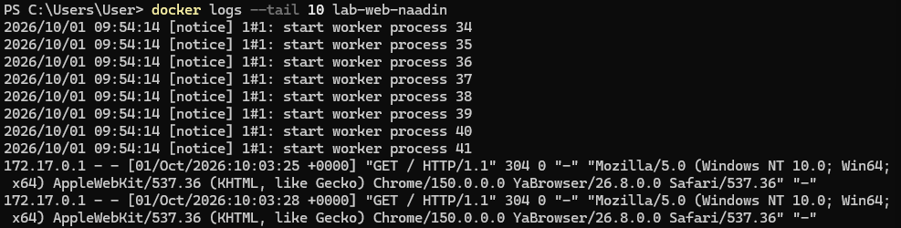

```bash
#прикрепление к основному процессу контейнера с помощью `attach`
docker attach lab-web-naadin
```
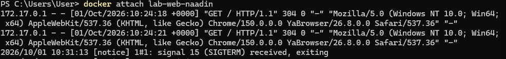

```bash
#проверим, что контейнер работает после закрытия `attach`
docker ps
```
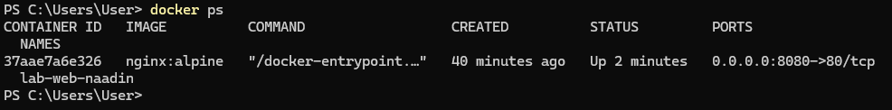

`Ctrl + P` + `Ctrl + Q` - отключиться от контейнера, не останавливая его. 
`Ctrl + C` - остановит контейнер.
* Использование этих сочетаний не сработало в PowerShell, поэтому пришлось перезапускать контейнер:

```bash
docker start lab-web-naadin
```
* После этого контейнер вновь в статусе `Up`, порт `8080`доступен.

[Получение логов](https://github.com/tiranousor/os-modern-docker-course/blob/main/4-course/docker-and-containers/lectures/03_docker_run.md#8-%D0%BB%D0%BE%D0%B3%D0%B8-%D0%BA%D0%BE%D0%BD%D1%82%D0%B5%D0%B9%D0%BD%D0%B5%D1%80%D0%B0-docker-logs), [прикрепление и открепление от контейнера](https://github.com/tiranousor/os-modern-docker-course/blob/main/4-course/docker-and-containers/lectures/02_commands.md#10-docker-attach-%D0%B8--d-%D0%BD%D0%B0-%D0%BF%D1%80%D0%B8%D0%BC%D0%B5%D1%80%D0%B5-%D0%B0%D0%BD%D0%B0%D0%BB%D0%B8%D0%B7%D0%B0-%D1%82%D0%B5%D0%BA%D1%81%D1%82%D0%B0)

### 6) Краткоживущий процесс

```bash
#запуск контейнера с текстом "pervaya"
docker run --name naadin nginx:alpine echo "pervaya"

#вывод статуса контейнера после выполнения
docker ps -a
```
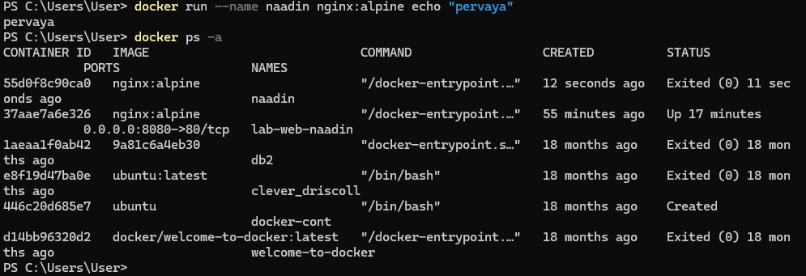

* Контейнер перешел в состояние `Exited(0)`, так как его единственная команда `echo` выполнилась мгновенно. Docker останавливает контейнер, когда завершается его главный процесс.

[Краткоживущий процесс](https://github.com/tiranousor/os-modern-docker-course/blob/main/4-course/docker-and-containers/lectures/03_docker_run.md#6-%D0%B0%D0%B2%D1%82%D0%BE%D0%BC%D0%B0%D1%82%D0%B8%D1%87%D0%B5%D1%81%D0%BA%D0%BE%D0%B5-%D1%83%D0%B4%D0%B0%D0%BB%D0%B5%D0%BD%D0%B8%D0%B5---rm)

### 7) Inspect
* Вырезка блока `mounts`

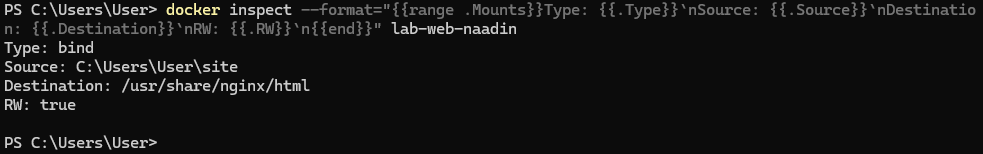

* Вырезка блока `ports`

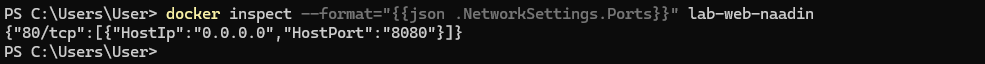

[Инспекция контейнера](https://github.com/tiranousor/os-modern-docker-course/blob/main/4-course/docker-and-containers/lectures/03_docker_run.md#7-%D0%B8%D0%BD%D1%81%D0%BF%D0%B5%D0%BA%D1%86%D0%B8%D1%8F-%D0%BA%D0%BE%D0%BD%D1%82%D0%B5%D0%B9%D0%BD%D0%B5%D1%80%D0%B0-docker-inspect)

### 8) Чистка
* Используем команды для удаления контейнеров и образов

```bash
#остановка контейнеров
docker stop lab-web-naadin naadin
#удаление контейнеров
docker rm lab-web-naadin naadin

#удаление образа
docker rmi nginx:alpine

#посмотрим список всех контейнеров
docker ps -a
#посмотрим список загруженных образов
docker images
```

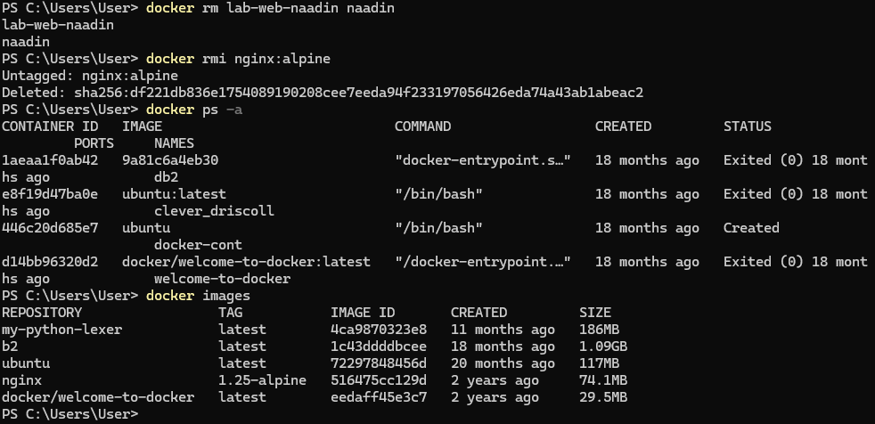

[Удаление контейнеров](https://github.com/tiranousor/os-modern-docker-course/blob/main/4-course/docker-and-containers/lectures/02_commands.md#4-docker-rm), [удаление образов](https://github.com/tiranousor/os-modern-docker-course/blob/main/4-course/docker-and-containers/lectures/02_commands.md#4-docker-rm](https://github.com/tiranousor/os-modern-docker-course/blob/main/4-course/docker-and-containers/lectures/02_commands.md#6-docker-rmi))

## Мини-квиз
### 1) Что произойдёт с данными, созданными внутри контейнера, если удалить контейнер без тома?
*  Данные пропадут навсегда. Чтобы данные сохранились, нужно использовать том, тогда они будут храниться вне контейнера.
### 2) Чем отличается порт хоста от порта в контейнере?
* Порт в контейнере - это порт, который "слушает" приложение внутри контейнера. Порт хоста - это порт на компьютере, через который можно "связаться" с приложением.
### 3) Для чего нужна пара флагов интерактивного запуска, и когда одного из них достаточно?
* Пара - это `-i` и `-t` (обычно используется вместе `-it`).
* -  `-i` - контейнер может принимать ввод с клавиатуры;
* -  `-t` - создает виртуальный терминал.
*  Чаще всего достаточно просто передать данные в контейнер, то есть достаточно `-i`.
### 4) Что показывает `Mounts` в `inspect` и как понять, что это именно bind‑mount?
* `Mounts` в `inspect` показывает все точки монтирования контейнера: какие пути хоста (или тома) куда подключены внутри контейнера. Понять, что это `bind-mount`, можно по полю `"Type": "bind"`.
### 5) Почему образ может не удаляться, и что нужно сделать перед удалением?
*  Образ не удалится, если от него зависят контейнеры — даже остановленные.
*  Что сделать перед удалением:
*  - нужно посмотреть все зависимые контейнеры;
*  - остановить их;
*  - удалить их;
*  - только после этого удалять образ.
*  Также можно попробовать `-f`, но это не гарантирует удаление всех контейнеров созданных из образа, перед удалением образа нужно удалить контейнеры, созданные из него.
